```mermaid
graph TD
    classDef accounting fill:#f8fafc,stroke:#475569,stroke-width:2px;
    classDef risk fill:#fef2f2,stroke:#ef4444,stroke-width:2px;
    classDef project fill:#f0fdf4,stroke:#22c55e,stroke-width:2px;

    subgraph "1. Accounting & Balance Sheet"
        A[Milestone Deposits M1-M4]:::accounting -->|Capitalization Criteria| B(Construction-in-Progress / CIP Asset):::accounting
        B -->|Withdrawal / Restudy Creep| C(Pre-Development Impairment / Write-off):::accounting
    end

    subgraph "2. Capital Projects Stage-Gates"
        D[FEL-1: Scoping]:::project -->|M1 Submission| E(FEL-2: Phase I & II SIS):::project
        E -->|M2/M3 Milestones| F(FEL-3: FEED & Phase III Fac Study):::project
        F -->|GIA Execution| G[FID & Construction Execution]:::project
    end

    subgraph "3. Cost Allocation Models"
        H[Participant Funding]:::risk -->|100% Developer Funded| K[High CapEx / Low OpEx Risk]:::risk
        I[Shared Cluster Sharing]:::risk -->|Cascade Risk / Last-Man Standing| K
        J[Backbone Allocation]:::project -->|Costs Socialized to Ratepayers| L[Low CapEx / Shared Grid Risk]:::project
    end
```

# Capital Projects, Accounting, & Risk Management Guide for Grid Interconnection
## A Strategic Manual for Energy Developers, CFOs, and Risk Officers
*Prepared using the KOMPOSOS-GRID queue analytical engine and RTO regulatory frameworks.*

---

## Executive Summary

Grid interconnection is no longer just an engineering milestone; it is the primary driver of capital allocation risk, balance sheet volatility, and project NPV variance for utility-scale energy developers. 

This guide translates the technical mechanics of **MISO's Definitive Planning Phase (DPP)** and **ERCOT's Connect-and-Manage (C&M)** processes into the language of corporate finance, capital projects management, and GAAP accounting. It specifically analyzes how different transmission cost-allocation models—including **Participant Funding**, **Shared Network Upgrades**, and **Backbone Allocations**—fundamentally reshape project risk profiles.

---



---

## 1. Accounting & Balance Sheet Perspective

For a developer, every step in the interconnection queue represents a cash outflow with varying degrees of recoverability. Under **US GAAP (ASC 360)** and **IFRS (IAS 16)**, developers must make rigorous accounting determinations regarding capitalization and impairment.

### A. Capitalization vs. Expensing of Interconnection Costs
Interconnection costs are divided into **study fees**, **milestone deposits**, and **security postings**.

1.  **Feasibility & Early-Stage Studies (Pre-Construction):**
    *   **GAAP Rule:** Costs incurred during the preliminary project stage (e.g., initial system impact studies, screening, and queue filing fees) must be expensed as incurred under **ASC 360**.
    *   **Capitalization Gate:** Capitalization only begins once a project is deemed **"probable of completion."** Typically, developers set this gate at the execution of a Generator Interconnection Agreement (GIA) or upon clearing the final System Impact Study (MISO DPP Phase III / ERCOT IA).
2.  **Interconnection Milestone Deposits (M1, M2, M3):**
    *   **Accounting Treatment:** Milestone deposits (such as MISO's M2 deposit of $4,000–$8,000/MW) are held on the balance sheet as **Restricted Cash** or **Prepaid Assets**.
    *   **Post-GIA Transition:** Once the GIA is executed and construction begins, these deposits are transferred to **Construction-in-Progress (CIP)** as part of the property, plant and equipment (PP&E) asset base.
3.  **Network Upgrade Funding (Developer Funded, Utility Owned):**
    *   Under FERC rules, the developer often physically funds the construction of regional transmission upgrades.
    *   **The Asset Mismatch:** The developer spends the cash, but the Transmission Owner (TO) owns and operates the physical line.
    *   **Accounting Resolution:** The developer recognizes a **Regulatory Asset** (or "Interconnection Receivable") on their balance sheet, representing the utility’s commitment to repay the developer over time via transmission service credits (plus interest) or cash refunds, depending on the RTO’s tariff.

### B. Impairment and Write-Off Risks
Because the overall queue completion rate is low (~18% in MISO, ~30% in ERCOT), developers face a persistent risk of asset impairment.

*   **The Write-Off Trigger:** If a project is withdrawn from the queue (due to restudy cost creep or regulatory delays), all capitalized pre-development costs (siting, environmental, engineering, legal) and forfeited milestone deposits must be **written off immediately** to the income statement as an impairment loss under **ASC 360-10**.
*   **Balance Sheet Volatility:** In MISO, where the post-IA build rate is only **34.9%**, developers frequently write off millions of dollars *after* executing contracts, causing significant quarterly earnings volatility. In contrast, ERCOT's **79.7%** post-IA build rate represents a much safer asset class with low write-off probability once the contract is signed.

---

## 2. Capital Projects Management (Stage-Gate Framework)

Utility-scale energy projects follow a standard **Front-End Loading (FEL)** stage-gate process. Interconnection milestones must be tightly mapped to these gates to manage capital risk.

| Capital Project Gate | Interconnection Equivalent (MISO) | Interconnection Equivalent (ERCOT) | Capital Risk Exposure |
| :--- | :--- | :--- | :--- |
| **FEL-1: Scoping & Site Selection** | Queue Application (M1 Milestone + 50% Site Control) | Interconnection Request (IR) submission | **Low:** Minimal study fees; speculative option agreements. |
| **FEL-2: Feasibility & Design** | DPP Phase I & II (System Impact Studies) | System Security Study (SSS) | **Medium:** Restricted cash deposits (M2/M3); site control validation. |
| **FEL-3: FEED & Detailed Design** | DPP Phase III (Facilities Study) | Full Interconnection Study (FIS) | **High:** Forfeiture risk of milestone deposits increases; engineering commitments. |
| **FID (Financial Investment Decision)** | GIA Execution (M4 Milestone / GIA deposit) | Standard IA Execution | **Critical:** Security posting for network upgrades (100% of estimated costs). |
| **Construction & Commissioning** | Commercial Operation Date (COD) | Commercial Operation Date (COD) | **Maximized CapEx:** Active construction; commissioning and synchronization. |

### A. MISO DPP Funnel Management & The "Cost Creep" Exit
MISO's DPP cluster system creates a highly volatile cash flow profile during **FEL-2** and **FEL-3**:
*   **M2 Milestone Entry:** To enter Phase II, the developer must post the M2 deposit ($4k–$8k/MW). For a 200 MW project, this is **$800,000 to $1.6M** in restricted cash.
*   **The Restudy Cascade:** If neighboring projects in the cluster withdraw, the Transmission Owner recalculates upgrade allocations. This creates "cost creep."
*   **The 50% Safe Harbor:** MISO's tariff allows a developer to withdraw **penalty-free** (reclaiming their M2 deposit) if their estimated upgrade costs increase by **50% or more** between Phase I and Phase II. Capital project managers use this threshold as a hard stage-gate: if the cost estimate exceeds the 50% threshold, it triggers an automatic project review to evaluate withdrawal.

### B. ERCOT Connect-and-Manage Certainty
ERCOT’s serial process allows developers to bypass cluster volatility:
*   **Parallel Tracks:** Detailed studies (FIS) run independently. Withdrawals do not trigger cascade restudies for other developers.
*   **Predictable Timeline:** A developer reaches the IA milestone in **20.3 months** (versus 29.8 months in MISO), providing a faster path to **FID (Financial Investment Decision)**.
*   **The Tradeoff:** The construction phase (IA $\to$ COD) takes longer in ERCOT (25.9 months vs 18.8 months) because the developer must coordinate the physical connection independently, and the project carries high operational curtailment risk.

---

## 3. Cost Allocation Mechanics & Backbone Transmission
*Responding to "backbone" and "network allocations" (concepts managed by RTO planners).*

How transmission upgrades are paid for determines whether a project is financially viable. RTOs use three primary allocation methods:

```
Participant Funding (100% Developer)   <===================>   Backbone Allocation (100% Socialized)
(High CapEx, Zero Cascade Risk)                                (Low CapEx, High Ratepayer Socialization)
                                       Shared Network Upgrade
                                     (Cluster-Based Risk Pool)
```

### A. Participant Funding (Direct Allocation)
*   **Mechanism:** The developer pays **100%** of the cost of any transmission upgrade required to connect their project.
*   **Accounting Impact:** Maximizes upfront **CapEx**. The developer capitalization asset base increases, lowering the project's IRR unless offset by high market prices.
*   **Risk Profile:** Low cascade risk (you only pay for your own upgrades), but extremely high barrier to entry at congested nodes.

### B. Shared Network Allocation (Cluster Cost Sharing)
*   **Mechanism:** Projects within the same study cluster share the cost of a common upgrade (e.g., a new substation or a line reconductoring) proportionally, usually based on their megawatt impact (Distribution Factors or DFAX).
*   **The Risk Management Nightmare ("Last Man Standing"):**
    *   If Project A, B, and C share a $30M upgrade ($10M each), and Project A and B withdraw late in the queue, **Project C is allocated the entire $30M cost**.
    *   This is the primary driver of late-stage queue withdrawals. Capital project managers must treat shared upgrade allocations not as a fixed cost, but as a **risk distribution** with a probability-weighted escalation factor.

### C. Backbone Allocation (Socialized Planning)
*   **Mechanism:** The RTO plans and constructs high-voltage, regional transmission lines ("backbone" lines, typically 345 kV and above) designed to improve system-wide reliability and deliverability. The cost of these upgrades is allocated to regional load (ratepayers) via transmission tariffs (e.g., MISO's **Multi-Value Project (MVP)** and **Long-Range Transmission Plan (LRTP)**).
*   **How it De-Risks Developers:**
    *   **CapEx Reduction:** By building a robust regional backbone, the RTO absorbs the bulk of the power-flow constraints. When a developer connects, the local network upgrades they trigger are minor, significantly reducing upfront developer CapEx.
    *   **Queue Stabilization:** Since local upgrades are smaller, the risk of cost creep from neighboring withdrawals is minimized, leading to more stable queue cycles.
    *   **MISO's Strategy:** MISO uses backbone planning (LRTP/MVP) to socialize transmission costs, helping developers offset the slow, complex DPP process.
    *   **ERCOT's Strategy:** ERCOT plans backbone transmission separately through its transmission service providers (TSPs), socialized to Texas consumers. However, because interconnection is fast, a developer may build a project *before* the backbone is complete, accepting temporary curtailment risk.

---

## 4. Risk Mitigation & Portfolio Management Rules

For corporate developers managing a portfolio of projects across multiple regions:

1.  **Discount Rate Adjustment:** Capital planners should apply a higher hurdle rate (discount rate) to MISO projects during the pre-GIA phase to account for the **35% post-IA completion risk**. Once a MISO project executes its GIA, the discount rate can be stepped down to reflect the low operational curtailment risk.
2.  **Curtailment Hedges (ERCOT):** Because ERCOT projects face immediate operational curtailment risk (West-to-North price spreads), developers must model operational revenue under a range of congestion scenarios. A common risk mitigation strategy is executing a **Virtual PPA** or physical hedge to stabilize project cash flows.
3.  **Contingency Reserves for Cost Creep:** During FEL-2, capital budgets for MISO projects must maintain a **30%–50% contingency reserve** specifically for shared network upgrade cost creep, until the DPP Phase III study is finalized.

---

## Summary Matrix for Corporate Finance

| Financial Metric | MISO (Invest-and-Deliver) | ERCOT (Connect-and-Manage) |
| :--- | :--- | :--- |
| **Upfront CapEx (Interconnection)** | **High:** Developers fund local and regional upgrades. | **Low:** Developers only fund the local tap/driveway. |
| **Capitalization Gate** | Delayed until DPP Phase III / GIA. | Earlier (upon SSS / IA clearance). |
| **Impairment Risk (Pre-FID)** | **Very High:** High probability of write-offs due to restudy cascades. | **Low:** Serial studies isolate project risk. |
| **Operational OpEx (Congestion/Curtailment)** | **Low:** System deliverability is verified upfront. | **High:** Projects face operational curtailment at binding nodes. |
| **Backbone Cost Socialization** | Socialized via MVP/LRTP to regional load. | Socialized to Texas ratepayers via TSP planning. |
