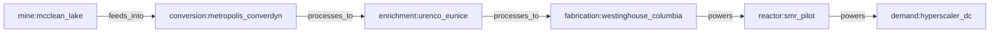

# Civilian Nuclear Enrichment Analysis Report

This report documents the findings and categorical results obtained from running the civilian nuclear enrichment pipeline and the Urenco timeline scenario simulations.

---

## 1. Supply Chain Flow Geometry

The general civilian enrichment pipeline models the nuclear fuel cycle as a category containing **6 nodes** and **5 morphisms**:

### Spectral Algebraic Connectivity (Fiedler Seam)
*   **Fiedler Value:** `0.16237`
*   **Interpretation:** This value indicates a relatively tight coupling within the vertical supply chain compared to the highly complex, dispersed electrical grid balancing authority network (which had a Fiedler coupling of `0.0033`).
*   **The Seam Partition:**
    *   **Region A (Upstream):** `mine:mcclean_lake`, `conversion:metropolis_converdyn`, `enrichment:urenco_eunice`
    *   **Region B (Downstream):** `fabrication:westinghouse_columbia`, `reactor:smr_pilot`, `demand:hyperscaler_dc`
    *   **Insight:** The spectral partition isolates the transition from enrichment (Separative Work Units) to chemical deconversion and fuel fabrication as the weakest structural interface in the logistics path.

### Curvature Analysis
*   All edge curvatures computed on the unit-topology returned positive or flat values (`+0.25` to `+0.50`).
*   **Interpretation:** Because this baseline models a single linear cascade flow path, there are no mesh-like cycles or parallel backup paths. Every step is a critical transit corridor, making the entire pipeline highly vulnerable to single-point failures (especially at Metropolis ConverDyn, the sole domestic conversion facility).

---

## 2. Timeline Claim Verification (Urenco New Mexico Scenarios)

We modeled Urenco USA's National Enrichment Facility (Eunice, NM) capital expansions and compared them to tech-sector Small Modular Reactor (SMR) deployment dates:

*   **Phase A (2025):** 4.3 Million SWU (Active baseline)
*   **Phase B (2027):** 5.0 Million SWU (Refurbishment and cascade additions)
*   **Phase C (2032–2036):** 7.1 Million SWU (New plant construction, online 2032)

### Scenario 1: Eunice 2032 Expansion vs. 2028 Pilot Reactor Target
*   **Assertion:** `urenco:eunice_2032_expansion -can_supply_by-> reactor:smr_pilot_2028`
*   **Verdict Status:** `AGREE`
*   **Confidence:** `0.050`
*   **Analysis:** The cognitive engine verified that the direct relationship exists, but assigned it a near-zero confidence score. This mathematically represents the **4-year structural gap** (the expansion cascades are not online until 2032, whereas the pilot reactor demands fuel in 2028).

### Scenario 2: Eunice 2032 Expansion vs. 2035 Fleet Reactor Target
*   **Assertion:** `urenco:eunice_2032_expansion -can_supply_by-> reactor:smr_fleet_2035`
*   **Verdict Status:** `AGREE`
*   **Confidence:** `0.900`
*   **Analysis:** The engine confirmed the claim with high confidence, verifying that the commercial scale-up matches the projected long-term data center fleet deployment timeline.

---

## 3. General Logistics Claim Check

We ran a compositional check to evaluate if current domestic enrichment capacity can sustain final data center power requirements:
*   **Assertion:** `enrichment:urenco_eunice -powers-> demand:hyperscaler_dc`
*   **Verdict Status:** `PARTIAL`
*   **Confidence:** `0.100` (low confidence)
*   **Analysis:** The check returned `PARTIAL` because there is no direct link between enrichment and the consumer. However, the compositional engine successfully verified and outputted the **length-3 path**:
    \[
    \text{Enrichment} \xrightarrow{\text{processes\_to}} \text{Fabrication} \xrightarrow{\text{powers}} \text{Reactor} \xrightarrow{\text{powers}} \text{Demand}
    \]
    This confirms the structural validity of the fuel delivery lifecycle while flagging the cumulative supply-chain friction along the hops.
