# Webinar Research Brief: Regional Study Processes (MISO vs. ERCOT)
*Prepared on June 24, 2026, in response to the i2X STITCH Webinar (June 23, 2026)*

This brief synthesizes the key concepts from the webinar presented by **Julia Matevosyan (ESIG)**, **Alyssa Hickey (MISO)**, **Vish Sankaran (Engie)**, and **Jenifer Fernandes (ERCOT)**. It contrasts the two grid systems, maps the webinar's operational details to this repository's codebase and UI, and suggests how the repository's models and tools can be enhanced to support the industry's evolving needs.

---

## 1. Profiles of the Presenters & Their Roles

*   **Julia Matevosyan (Chief Engineer, ESIG):**
    A leading expert on the integration of wind, solar, and battery storage. She coordinates the **i2X STITCH** (Studies, Tools, and Interconnection Consistency and Harmonization) initiative, which is a joint Department of Energy (DOE), National Lab, and industry effort to standardize and accelerate grid interconnection across the United States.
*   **Alyssa Hickey (South DPP Engineer, MISO):**
    A Generator Interconnection engineer at the Midcontinent Independent System Operator (MISO). She administers MISO's cluster-based study process for the South region, focusing on Definitive Planning Phase (DPP) timelines, cost allocation audits, and queue reforms designed to filter speculative projects.
*   **Vish Sankaran (Director of Transmission & Interconnection Analytics, Engie):**
    Represents the developer’s perspective. Engie is a major global renewable energy developer. Vish analyzes how queue wait times, study delays, network upgrade costs, and market congestion affect project economics and investment decisions.
*   **Jenifer Fernandes (Manager of Interconnection Services, ERCOT):**
    Manages generator interconnection studies for the Electric Reliability Council of Texas (ERCOT), overseeing Texas's distinct "connect-and-manage" process.

---

## 2. Process & Allocation Mechanics: MISO vs. ERCOT

The presentations highlighted two fundamentally different philosophies of grid interconnection:

### MISO: "Invest-and-Deliver" with Definitive Planning Phase (DPP)
MISO uses a highly structured, clustered study process designed to ensure that the broader network can handle and deliver the generator's power.

```mermaid
graph TD
    A[Queue Application] -->|50% Site Control + Milestone M1| B(DPP Phase I: Prelim SIS)
    B -->|Milestone M2| C(DPP Phase II: Revised SIS, Stability, Short Circuit)
    C -->|Milestone M3| D(DPP Phase III: Final SIS, Network Upgrade Facilities Study)
    D -->|Milestone M4| E[Generator Interconnection Agreement - GIA]
    
    style B fill:#1e293b,stroke:#38bdf8,stroke-width:2px
    style C fill:#1e293b,stroke:#a855f7,stroke-width:2px
    style D fill:#1e293b,stroke:#f59e0b,stroke-width:2px
    style E fill:#0f172a,stroke:#22c55e,stroke-width:3px
```



*   **The DPP Phases:** The process groups projects into yearly geographic "clusters" that undergo three phases:
    1.  **Phase I:** Preliminary System Impact Study (SIS) providing initial cost estimates.
    2.  **Phase II:** Detailed SIS, including stability and short-circuit studies, plus Affected System Studies (neighboring grids).
    3.  **Phase III:** Final SIS and Facilities Study to pin down the exact engineering design and costs.
*   **Queue Capacity Waves:**
    *   **DPP-2022 Cycle:** Saw a record-breaking **171 GW** of requests, overwhelming MISO's engineering capacity.
    *   **DPP-2023 Cycle:** Fell to **123 GW** following initial queue reform proposals.
    *   **DPP-2025 Cycle:** Fell further to **78 GW** (launched in Jan 2025) as MISO enforced strict **Queue Caps** (limiting studied capacity to 50% of regional peak load) to prevent oversubscription.
*   **Late-Stage Withdrawals & Cost Creep:**
    *   When a developer withdraws a project in Phase II or Phase III (a "late-stage withdrawal"), MISO must re-study the remaining projects in the cluster, recalculating who pays for which shared upgrades. This triggers a cascade of delays and cost volatility ("cost creep").
    *   **50% Cost Control Threshold:** MISO's tariff allows a developer to withdraw **penalty-free** between Phase 1 and Phase 2 if their estimated Network Upgrade and Affected System costs increase by **50% or more**. This protects developers from unexpected cost spikes but can destabilize the rest of the cluster.
*   **Transmission Cost Allocation:**
    *   *Direct/Participant Funding:* Developers pay 100% of local interconnection upgrades.
    *   *Shared Network Upgrades:* Upgrades that benefit multiple projects in the same cluster are shared proportionally.
    *   *Backbone Allocation:* Through the **Long-Range Transmission Plan (LRTP)** and **Multi-Value Project (MVP)** processes, MISO plans large regional transmission lines (backbone) and socializes the costs to ratepayers (load) because they improve system-wide reliability and deliverability, taking the cost burden off individual developers.

### ERCOT: "Connect-and-Manage" (C&M)
ERCOT takes a market-first approach, prioritizing rapid grid access and delegating long-term congestion management to the wholesale energy market.
*   **Fast Local Onboarding:** Studies focus strictly on the local connection facilities (the "driveway"). ERCOT does not hold up a project's connection to study or build regional transmission upgrades (the "highway").
*   **Decoupled Transmission Planning:** ERCOT plans regional transmission separately through its annual planning cycles, socialized to Texas ratepayers, but this happens *after* or *independently of* the generator's queue timeline.
*   **The Developer's Risk:** Under C&M, the developer is allowed to connect quickly but gets no guarantee of deliverability. If regional lines are constrained, the generator is **curtailed** (turned off) or faces low/negative Localized Marginal Prices (LMPs) at their node. 
*   *As Vish Sankaran noted:* ERCOT offers faster onboarding (speed-to-market), but the developer absorbs the long-term risk of operational curtailment and financial loss. MISO is slower and costlier upfront, but developers get firmer grid access once cleared.
*   **Batch Zero (2026):** Because of massive incoming data center and industrial loads, ERCOT recently introduced the "Batch Zero" process to study large load interconnections (75 MW+) collectively rather than individually, preventing localized reliability collapses.

---

## 3. How This Relates to the Current Codebase

The repository contains several engines and datasets that directly reflect these concepts:

| Webinar Concept | Repo Module / File | How it Maps |
|---|---|---|
| **Interconnection Milestones & Funnel** | [queue_analysis.py](file:///c:/Users/JAMES/github/KOMPOSOS-GRID/domains/grid/queue_analysis.py) | Slices LBNL queue data to compute completion rates by milestone (e.g., `ia_executed`). It shows that ERCOT's executed IA is a firm commitment (~80% built), whereas MISO's is a coin-flip (~35% built) due to late-stage DPP risks. |
| **Study-Cycle Trends** | [run_stitch_brief.py](file:///c:/Users/JAMES/github/KOMPOSOS-GRID/domains/grid/run_stitch_brief.py) | Cohorts projects by MISO DPP cluster cycle (e.g., `DPP-2016`, `DPP-2022`) and ERCOT entry years. It verifies the massive wave of early withdrawals in reform-era MISO cycles (like DPP-2022, where 522 out of 911 projects withdrew early). |
| **Intra-ISO Congestion Spreads** | [sources/ercot.py](file:///c:/Users/JAMES/github/KOMPOSOS-GRID/domains/grid/sources/ercot.py) & [ercot_hub_spreads.md](file:///c:/Users/JAMES/github/KOMPOSOS-GRID/reports/ercot_hub_spreads.md) | Computes the hourly price spread between West Texas (HB_WEST, high wind export) and North Texas (HB_NORTH, load center). This spread is the financial footprint of ERCOT's curtailment and congestion risk, rising from **$4.94/MWh** (2023) to **$5.78/MWh** (2025). |
| **MISO Seam & Transmission Constraints** | [sources/miso.py](file:///c:/Users/JAMES/github/KOMPOSOS-GRID/domains/grid/sources/miso.py) & [sources/miso_constraints.py](file:///c:/Users/JAMES/github/KOMPOSOS-GRID/domains/grid/sources/miso_constraints.py) | Parses MISO binding constraints and interface prices (e.g., MISO-SWPP seam at $5.09/MWh congestion) which highlight where backbone or Joint Targeted Interconnection Queue (JTIQ) transmission upgrades are needed. |
| **Transmission Relief Curves** | [relief_curves.py](file:///c:/Users/JAMES/github/KOMPOSOS-GRID/domains/grid/relief_curves.py) | Fits spread-vs-capacity curves to estimate how much transmission capacity (MW) is needed to relieve congestion spreads. This aligns with MISO's MVP/LRTP backbone planning. |

---

## 4. How the Codebase and Models Can Be Improved

To make this repo more useful to developers like Vish or grid engineers like Alyssa, we can expand the model in three areas:

### A. Model the MISO DPP Phased Queue explicitly
Currently, the codebase groups `ia_status` into coarse categories. We can refine [queue_analysis.py](file:///c:/Users/JAMES/github/KOMPOSOS-GRID/domains/grid/queue_analysis.py) to parse and model transitions between the three DPP phases:
*   Add tracking for **Phase I, Phase II, and Phase III** transitions.
*   Calculate conditional probability of transition: $P(Phase\_II \mid Phase\_I)$, $P(GIA \mid Phase\_III)$, and exit rates.
*   Model the **50% cost control threshold** by calculating the percentage of historic withdrawals that coincided with Phase II transition, showing where developers hit the "re-study cost creep" wall.

### B. Build a Developer Risk Trade-off Calculator
To address Vish Sankaran's core challenge, we can build a decision-support module that models the financial trade-offs between the two regions:
1.  **MISO Pathway:** Slower siting time (median 30 months to IA) + High Upfront Cost (Network Upgrades) $\to$ Low Operational Curtailment/Congestion.
2.  **ERCOT Pathway:** Faster siting time (median 20 months to IA) + Low Upfront Cost $\to$ High Operational Curtailment (modeled from the West-North hub price spreads in [sources/ercot.py](file:///c:/Users/JAMES/github/KOMPOSOS-GRID/domains/grid/sources/ercot.py)).
*   *Implementation:* Build a cash-flow model that evaluates project Net Present Value (NPV) under both regimes based on project capacity (MW), technology (wind/solar/battery), and expected asset life.

### C. Simulate Shared Network & Backbone Cost Allocation
We can implement a simple cost-sharing module using the existing network topology data:
*   Model a cluster of projects on a seam.
*   Compare **Participant Funding** (each project pays 100% of its triggered transmission upgrades) vs. **Shared Network Allocation** (projects in a cluster share upgrade costs proportionally) vs. **Backbone Allocation** (50% of the cost of upgrades above $100\text{kV}$ is allocated to load).
*   Demonstrate mathematically how backbone allocation reduces developer capital expenditure (CapEx) and lowers queue withdrawal rates.

---

## 5. How to Run the UI on the Web

The user can present these findings via two interactive interfaces that can be run locally or hosted publicly:

### Option A: The Streamlit Web App (`streamlit_app.py`)
The repo has a Streamlit-based portfolio app. It is already configured to read project registries and can be run locally or deployed to the web.

*   **Local Run:**
    Open a terminal in the repo root and run:
    ```bash
    pip install streamlit
    streamlit run streamlit_app.py
    ```
    This opens a browser window with the interactive workbench.
*   **Web Deployment (Free & Easy):**
    The app can be hosted for free on **Streamlit Community Cloud**:
    1.  Push the codebase to a public GitHub repository.
    2.  Sign in to [share.streamlit.io](https://share.streamlit.io/) using GitHub.
    3.  Click **"New App"**, select the repository, branch (`master`), and file path (`streamlit_app.py`).
    4.  Click **"Deploy"**. The app will be live at a custom URL (e.g., `https://komposos-grid.streamlit.app/`).

### Option B: The Static HTML Dashboard (`docs/index.html`)
The repo has a static dashboard generator that requires no server, database, or JavaScript CDNs, making it highly secure and fast.

*   **Generate the Dashboard:**
    Run the following command to parse the reports and write the static HTML page:
    ```bash
    python -m domains.grid.run_dashboard
    ```
    This writes a single self-contained file to `docs/index.html`.
*   **Web Deployment (GitHub Pages):**
    Because the output is saved in the `/docs` folder, it can be served automatically via GitHub Pages:
    1.  Go to the repository on GitHub.
    2.  Click **Settings** $\to$ **Pages**.
    3.  Under **Build and deployment**, set the source to **"Deploy from a branch"**.
    4.  Select your branch (`master`) and change the folder dropdown from `/ (root)` to `/docs`.
    5.  Click **Save**. GitHub will publish the site within minutes at `https://<username>.github.io/komposos-grid/`.
*   **Shareable Artifacts:**
    The folder `reports/stitch_2026-06-23/` already contains `queue_process_brief.html`. You can email this file directly to anyone; they can double-click it to open it in their browser offline.
